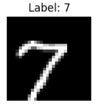

# MNIST Classification

This project demonstrates the training and evaluation of a Convolutional Neural Network (CNN) on the MNIST dataset using PyTorch. The notebook includes data preprocessing, model training, hyperparameter tuning, and performance evaluation.

## Streamlit UI


---

## Table of Contents
1. [Dataset Overview](#dataset-overview)
2. [Data Preprocessing](#data-preprocessing)
3. [Model Architecture](#model-architecture)
4. [Training and Validation](#training-and-validation)
5. [Performance Metrics](#performance-metrics)
6. [Sample Predictions](#sample-predictions)
7. [Screenshots](#screenshots)

---

## Dataset Overview
The MNIST dataset consists of 60,000 training images and 10,000 test images of handwritten digits (0-9). Each image is grayscale and has a resolution of 28x28 pixels.

---

## Data Preprocessing
- **Training Transformations**: Random rotations, translations, and scaling were applied to augment the training data.
- **Validation/Test Transformations**: Normalization was applied to standardize pixel values.

---

## Model Architecture
The CNN model (`ConvNet`) consists of:
- Convolutional layers with ReLU activation
- Max-pooling layers
- Fully connected layers
- Dropout for regularization

---

## Training and Validation
- **Optimizer**: Adam
- **Loss Function**: CrossEntropyLoss
- **Hyperparameter Tuning**: Grid search with cross-validation was used to find the best learning rate, batch size, and dropout rate.

---

## Performance Metrics
The model was evaluated using the following metrics:
- Accuracy
- Precision
- Recall
- F1-Score

### Training and Validation Accuracy


---

## Sample Predictions
Below are some sample predictions made by the trained model:

| **Image** | **True Label** | **Predicted Label** |
|-----------|----------------|---------------------|
|  | 5 | 5 |
|  | 1 | 1 |
|  | 7 | 7 |

---

## Screenshots

### 1. Class Distribution


### 2. Training and Validation Loss


### 3. Confusion Matrix


---

## How to Run

1. Clone the repository:
    ```bash
    git clone https://github.com/Pushparaj95/Final_Project_Guvi.git
    cd 1. Handwritten Image Recogniser_MNIST
    ```

2. Install dependencies:
    ```bash
    pip install -r requirements.txt
    ```

3. Run the Streamlit app:
    ```bash
    streamlit run Predictor_UI.py
    ```

4. Follow the steps in the notebook to train the model and make predictions.

---

## Acknowledgments
- [PyTorch](https://pytorch.org/)
- [MNIST Dataset](http://yann.lecun.com/exdb/mnist/)