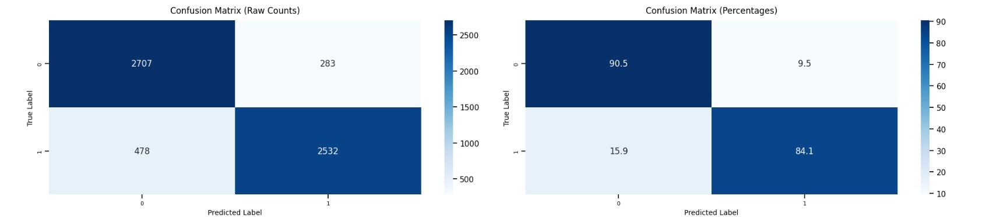

# Sentiment Analysis on IMDB Reviews

This project implements a sentiment analysis model using an LSTM-based neural network to classify IMDB movie reviews as positive or negative. The model is trained on a preprocessed dataset and achieves high accuracy on unseen test data.

---

## Table of Contents
1. [Project Overview](#project-overview)
2. [Dataset](#dataset)
3. [Preprocessing](#preprocessing)
4. [Model Architecture](#model-architecture)
5. [Training and Validation](#training-and-validation)
6. [Evaluation](#evaluation)
7. [Insights](#insights)
8. [Screenshots](#screenshots)
9. [How to Run](#how-to-run)

---

## Project Overview

The goal of this project is to classify movie reviews as either positive or negative using a deep learning model. The project includes:
- Data preprocessing
- Exploratory Data Analysis (EDA)
- Model training and evaluation
- Real-time review predictions

---

## Dataset

The dataset used is the IMDB Dataset of 50,000 movie reviews. It contains two columns:
- `review`: The text of the review
- `sentiment`: The sentiment label (`positive` or `negative`)

---

## Preprocessing

The preprocessing pipeline includes:
1. Cleaning the text (removing special characters, links, etc.)
2. Tokenizing and lemmatizing the text
3. Removing stopwords
4. Padding sequences to a fixed length

---

## Model Architecture

The model is an LSTM-based neural network with the following layers:
- Embedding layer
- LSTM layer with 2 layers and dropout
- Fully connected layer
- Sigmoid activation for binary classification

---

## Training and Validation

- **Optimizer**: Adam
- **Loss Function**: Binary Cross-Entropy Loss
- **Metrics**: Accuracy
- **Epochs**: 5
- **Batch Size**: 32

The model was trained on 80% of the data, with 10% used for validation.

---

## Evaluation

The model achieved an accuracy of **88%** on the test dataset. Below is the confusion matrix for the test data:



---

## Insights

1. **Review Length Distribution**:
    - Positive reviews have an average length of 232 words.
    - Negative reviews have an average length of 229 words.

2. **Model Performance**:
    - The model performs well on both positive and negative reviews, with minimal misclassifications.

3. **Real-Time Predictions**:
    - The model can predict sentiments for new reviews with high accuracy.

---

## Screenshots

### Model Performance Merics


### Training and Validation Loss/Accuracy


---

## How to Run

1. Clone the repository:
    ```bash
    git clone https://github.com/your-repo/sentiment-analysis.git
    cd Sentiment_Analysis_IMDB
    ```

2. Install dependencies:
    ```bash
    pip install -r requirements.txt
    ```

3. Run the Streamlit app:
    ```bash
    streamlit run Review_Analyser.py
    ```

4. Follow the steps in the notebook to train the model and make predictions.

---

## Final Model Review Predictions

Here are some real-time predictions made by the model:


| Review | Actual Sentiment | Predicted Sentiment | Confidence Score |
|--------|------------------|---------------------|------------------|
| "Acting was trash, literally no plot whatsoever..." | Negative | Negative 😫 | 0.05 |
| "I can't agree with the negative reviews on here..." | Positive | Positive 😄 | 0.85 |
| "The Lion King (1994) is my favorite Disney movie..." | Negative | Negative 😤 | 0.25 |
| "I absolutely love this movie, and I'm giving it..." | Positive | Positive 😍 | 0.95 |

## Streamlit UI
Here is a simple Streamlit UI to interact with the model:

---